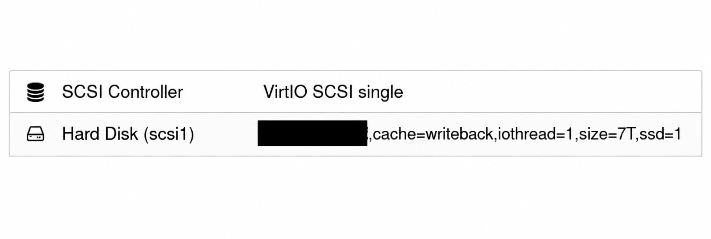
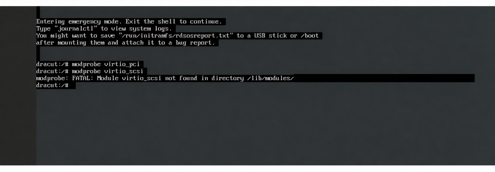
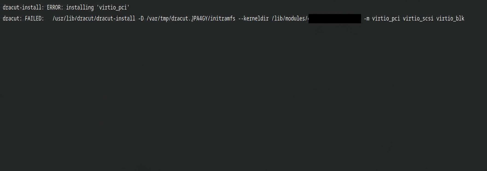
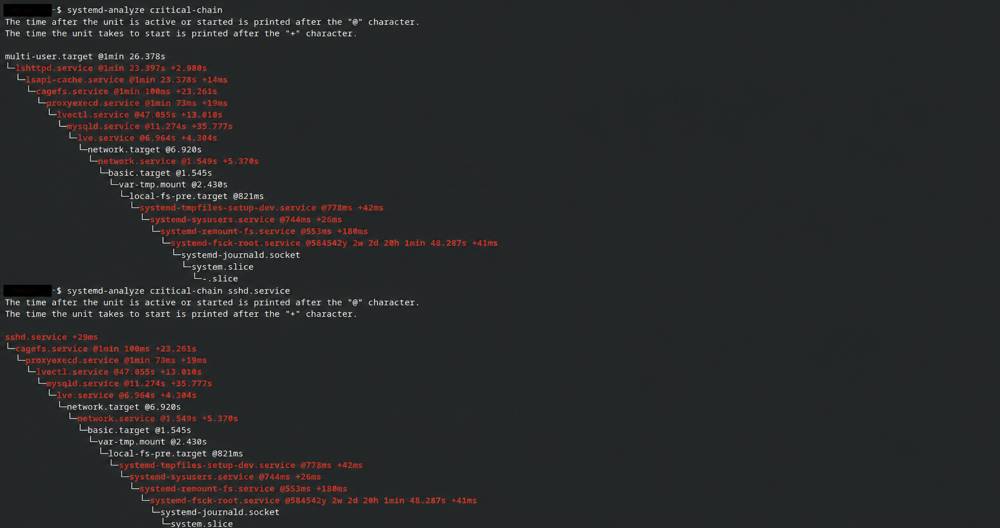

# ESXi to Proxmox: CloudLinux VirtIO SCSI Migration Case Study

[](LICENSE)
[](https://www.proxmox.com/)
[](https://www.cloudlinux.com/)

> Recovering a CloudLinux boot failure after changing an imported VMware ESXi
> virtual disk from SATA to VirtIO SCSI, and documenting the observed 52%
> reduction in time to `multi-user.target`.

## Overview

This repository documents a real-world migration of a large cPanel virtual
machine running CloudLinux from VMware ESXi to Proxmox VE.

The VM initially booted with its imported disk attached through an emulated
SATA controller. It was functional, but boot and service initialization were
unusually slow. Changing the disk directly to `VirtIO SCSI single` caused the
guest to enter the Dracut emergency shell because the boot-time initramfs did
not contain the `virtio_scsi` driver.

The working solution was to boot through SATA, explicitly include
`virtio_scsi` in the initramfs, validate the rebuilt image, and then reattach
the same virtual disk through the Proxmox VirtIO SCSI controller.

No customer data, IP addresses, MAC addresses, account names, filesystem
UUIDs, or internal infrastructure identifiers are included here.

## Result Summary

| Metric | Initial state | Final observed state | Change |
|---|---:|---:|---:|
| Time to `multi-user.target` | 2m 59.912s | 1m 26.378s | 93.534s faster (~52%) |
| MySQL startup | 2m 2.590s | 35.777s | 86.813s faster (~71%) |
| LVE startup | 7.263s | 4.304s | 2.959s faster (~41%) |
| CageFS startup | 25.373s | 23.261s | 2.112s faster (~8%) |

These are operational observations from this VM, not a controlled storage
benchmark. Host caching, service state, storage hardware, clean versus
unclean shutdowns, and disconnected networking can all affect boot results.

## Visual Evidence

### Final Proxmox storage attachment



*The disk is attached through `VirtIO SCSI single` with IO Thread enabled. The
storage-volume identifier has been redacted.*

### Boot failure before rebuilding initramfs



*The installed system had the driver, but the boot-time initramfs did not.*

### Dracut driver-list failure discovered during a kernel update



*Forcing unavailable module names caused the initramfs build to fail. The
working configuration explicitly forced only `virtio_scsi`.*

### Final service critical path



*The final critical chain reached `multi-user.target` in 1m 26.378s. The shell
prompt identity has been redacted.*

## Environment

| Component | Configuration |
|---|---|
| Source hypervisor | VMware ESXi |
| Target hypervisor | Proxmox VE / QEMU / KVM |
| Guest OS | CloudLinux |
| Kernel | CloudLinux LVE kernel |
| Firmware | OVMF (UEFI) |
| Machine type | i440fx |
| vCPU | 48 |
| Memory | 64 GiB |
| Virtual disk | 7 TB |
| Original disk bus | SATA |
| Final disk bus | SCSI |
| SCSI controller | VirtIO SCSI single |
| IO Thread | Enabled |
| Workload | CloudLinux, cPanel, LiteSpeed, MySQL and security services |

## Symptoms

The investigation started with three separate symptoms:

1. The imported VM was slow to become operational even with external network
   traffic disconnected.
2. The active virtual disk was attached as a SATA device even though the VM
   had a `VirtIO SCSI single` controller configured.
3. After moving the boot disk from SATA to SCSI, the kernel and initramfs
   loaded, but Dracut could not find the root filesystem UUID.

The emergency shell showed the decisive error:

```text
Warning: /dev/disk/by-uuid/<root-filesystem-uuid> does not exist

dracut:/# modprobe virtio_scsi
modprobe: FATAL: Module virtio_scsi not found in directory /lib/modules/<kernel-version>
```

## Root Cause

There were two related configuration facts:

- Selecting `VirtIO SCSI single` in Proxmox only defines the VM's SCSI
  controller. A disk displayed as `sata0` or `sata1` is still using SATA and
  does not use that VirtIO SCSI controller.
- The installed CloudLinux system contained
  `/lib/modules/<kernel>/kernel/drivers/scsi/virtio_scsi.ko.xz`, but the
  current initramfs did not contain the module. UEFI could start the boot
  process, while the early Linux userspace could not discover and mount the
  SCSI root disk.

The filesystem UUID had not changed. The device providing that UUID was simply
unavailable to Dracut because the required driver was missing at boot time.

## Safe Migration Procedure

> [!CAUTION]
> Validate backups before changing a production VM. Use **Detach**, not
> **Remove**, when changing the bus of an existing Proxmox disk. Do not delete
> the underlying volume.

### 1. Boot using the known-good SATA configuration

Before changing the disk bus, verify the running kernel, block devices, root
filesystem, and boot parameters:

```bash
uname -r
lsblk -f
findmnt -no SOURCE /
cat /proc/cmdline
grep -vE '^[[:space:]]*(#|$)' /etc/fstab
```

Using filesystem UUIDs in `/etc/fstab` and the kernel command line avoids
depending on device names such as `/dev/sda`.

### 2. Verify the VirtIO SCSI module on the installed system

```bash
modinfo virtio_scsi
find "/lib/modules/$(uname -r)" -type f -name 'virtio_scsi.ko*'
modprobe virtio_scsi
```

`modinfo` and `find` should identify the module for the running kernel, and
`modprobe` should complete without an error.

### 3. Persist early loading through Dracut

Create a dedicated Dracut configuration file:

```bash
install -d -m 0755 /etc/dracut.conf.d
printf 'force_drivers+=" virtio_scsi "\n' > /etc/dracut.conf.d/virtio.conf
```

`force_drivers` both includes the kernel module and asks Dracut to load it
early. This is useful when the root filesystem itself will be placed behind
that controller.

Do not blindly add `virtio_pci` or `virtio_blk`. On this tested CloudLinux
kernel, Dracut reported an installation error for `virtio_pci` because it was
not available as a separate loadable module in the expected form. Only list
modules that are valid for the target kernel.

### 4. Back up and rebuild the current initramfs

```bash
KERNEL_VERSION="$(uname -r)"
BACKUP_SUFFIX="$(date -u +%Y%m%dT%H%M%SZ)"

cp -a \
  "/boot/initramfs-${KERNEL_VERSION}.img" \
  "/boot/initramfs-${KERNEL_VERSION}.img.${BACKUP_SUFFIX}"

dracut --force --verbose \
  "/boot/initramfs-${KERNEL_VERSION}.img" \
  "${KERNEL_VERSION}"

echo "DRACUT_EXIT=$?"
```

Do not reboot or change the disk bus unless the Dracut exit status is `0`.

Confirm that the module is present in the new image:

```bash
lsinitrd "/boot/initramfs-${KERNEL_VERSION}.img" | grep virtio_scsi
```

Expected output includes a path similar to:

```text
usr/lib/modules/<kernel-version>/kernel/drivers/scsi/virtio_scsi.ko.xz
```

### 5. Change the Proxmox disk bus

Shut down the guest cleanly and make the following changes in Proxmox:

1. Set **SCSI Controller** to `VirtIO SCSI single`.
2. Detach the existing SATA disk. Do not remove or delete its volume.
3. Reattach the same volume as a SCSI disk.
4. Enable **IO Thread** for the disk.
5. Update **Boot Order** so the new SCSI disk is enabled and selected first.
6. Start the VM and watch the console during the first boot.

Cache mode and SSD emulation should be selected according to the actual
backing storage and durability requirements. They are not universal
performance switches.

### 6. Validate the SCSI boot

After the guest starts successfully:

```bash
lsblk -f
findmnt -no SOURCE /
lsmod | grep virtio_scsi
systemd-analyze
systemd-analyze blame | head -30
systemd-analyze critical-chain
systemd-analyze critical-chain sshd.service
iostat -xz 1 10
```

## Rollback Procedure

If the guest enters the Dracut emergency shell:

1. Stop the VM from Proxmox.
2. Detach the SCSI disk without deleting the underlying volume.
3. Reattach the same volume using its previous SATA slot.
4. Restore the previous boot order.
5. Boot the VM and correct the initramfs from the running system.

This rollback changes only the virtual controller attachment. It does not
convert, copy, or modify filesystem data inside the virtual disk.

## Kernel Update Safety

A later CloudLinux kernel update installed a new kernel while the running VM
was already using SCSI. The package transaction attempted to build a new
initramfs and exposed the same invalid driver-list problem.

Before rebooting into any newly installed kernel, verify and rebuild its
initramfs explicitly:

```bash
NEW_KERNEL="<new-kernel-version>"

modinfo -k "${NEW_KERNEL}" virtio_scsi

dracut --force --verbose \
  "/boot/initramfs-${NEW_KERNEL}.img" \
  "${NEW_KERNEL}"

echo "DRACUT_EXIT=$?"
lsinitrd "/boot/initramfs-${NEW_KERNEL}.img" | grep virtio_scsi
```

Do not reboot into the new kernel until Dracut exits successfully and
`lsinitrd` confirms that `virtio_scsi` is present.

## Boot Analysis

The initial critical path was approximately:

```text
network.service
  -> lve.service
  -> mysqld.service
  -> lvectl.service
  -> cagefs.service
  -> sshd.service / lshttpd.service
  -> multi-user.target
```

In the final observed state:

- `sshd.service` itself needed only about 29 ms.
- SSH availability was delayed by the CloudLinux and cPanel dependency chain,
  not by SSH initialization.
- MySQL remained the largest service-level delay at approximately 35.8
  seconds.
- CageFS and `lvectl` remained the next most visible items in the critical
  path.

The SCSI change improved the observed startup substantially, but it did not
eliminate application-level initialization delays.

## Measurement Notes and Limitations

- This was a production workload investigation, not a synthetic benchmark.
- Networking was disconnected during part of the testing. Services such as
  package metadata refreshers, licensing clients, and security agents may wait
  for outbound network timeouts.
- A separate third-party monitoring exporter was found in a rapid restart
  loop. Unrelated crash loops should be stopped or repaired before collecting
  final performance measurements.
- MySQL startup time can vary because of crash recovery, buffer pool state,
  database size, and clean versus forced shutdowns.
- Results from one VM and storage stack should not be generalized as a
  guaranteed performance gain for every Proxmox environment.

## Why `VirtIO SCSI single`?

Proxmox recommends VirtIO-based storage for paravirtualized guest I/O.
`VirtIO SCSI single` allows a dedicated controller and IO thread per disk,
which can reduce QEMU I/O contention and emulation overhead for suitable
workloads.

## References

- [Proxmox VE `qm` manual](https://pve.proxmox.com/pve-docs/qm.1.html)
- [Proxmox VE migration documentation](https://pve.proxmox.com/wiki/Migrate_to_Proxmox_VE)
- [`dracut.conf(5)` manual](https://man7.org/linux/man-pages/man5/dracut.conf.5.html)
- [`dracut(8)` manual](https://man7.org/linux/man-pages/man8/dracut.8.html)
- [`systemd-analyze` manual](https://www.freedesktop.org/software/systemd/man/latest/systemd-analyze.html)

## Author

**Saeed Yavari (Leo Ryan)**  
Linux System Administrator and Infrastructure Engineer  
GitHub: [@isaeedyavari](https://github.com/isaeedyavari)

## License

This project is licensed under the [MIT License](LICENSE).

The procedures are provided as operational documentation without warranty.
Validate them in a test environment and maintain recoverable backups before
using them on production infrastructure.
